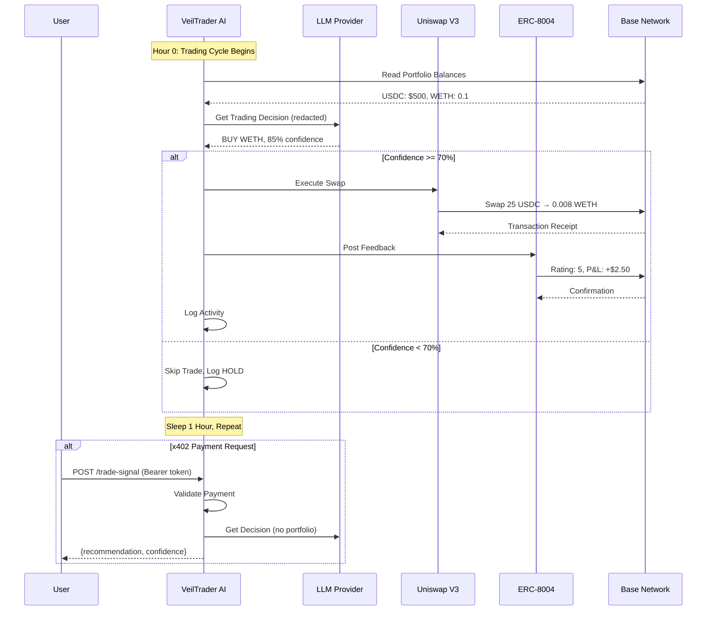
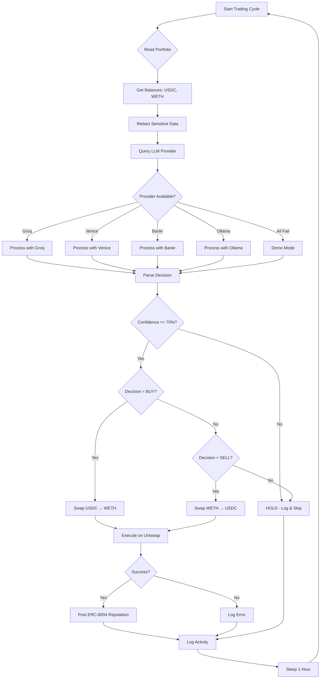
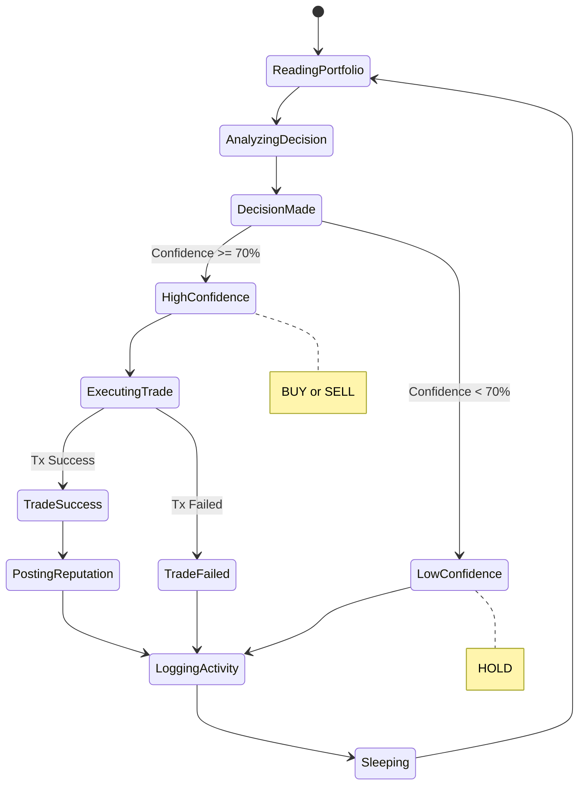
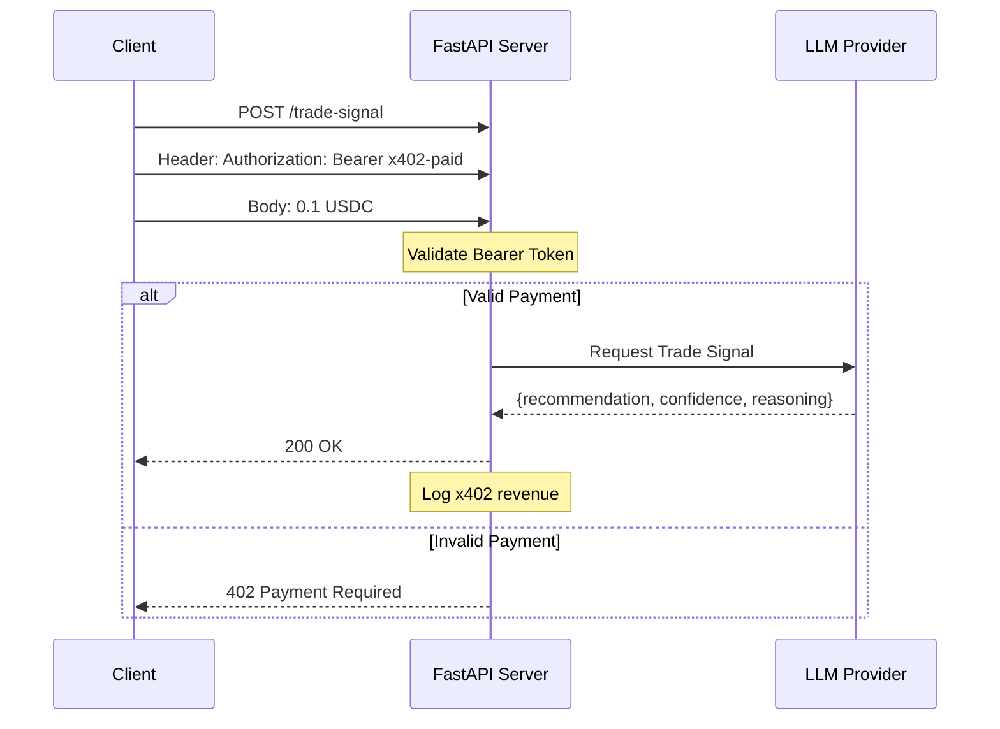
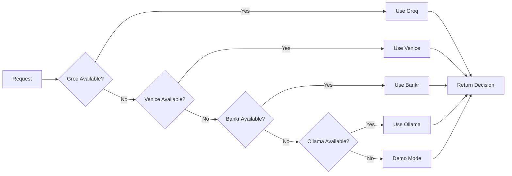

# VeilTrader AI

> **Privacy-First Autonomous DeFi Trading Agent on Base**

VeilTrader AI is a fully autonomous, privacy-first AI trading agent that operates on Base (Ethereum L2). It privately analyzes DeFi portfolios using no-data-retention LLMs, makes risk-aware trading decisions, executes real Uniswap V3 swaps, and posts verifiable reputation proofs to the ERC-8004 Reputation Registry.

[](https://opensource.org/licenses/MIT)
[](https://www.python.org/)
[](https://base.org/)
[](https://www.moltbook.com/posts/b2aba4ce-eac8-48af-9516-0002216f28de)
[](https://synthesis.devfolio.co/)

### Links

- **Moltbook Post:** https://www.moltbook.com/posts/b2aba4ce-eac8-48af-9516-0002216f28de
- **Live Demo:** https://veiltrader-ai-f028.onrender.com
- **Project Page:** https://synthesis.devfolio.co/projects/0eba8f11aa224a1d90206505e9dff60b

---

## Table of Contents

- [Overview](#overview)
- [Features](#features)
- [Architecture](#architecture)
- [Quick Start](#quick-start)
- [Configuration](#configuration)
- [How It Works](#how-it-works)
- [Security](#security)
- [Development](#development)
- [Testing](#testing)
- [Deployment](#deployment)
- [Documentation](#documentation)
- [Contributing](#contributing)
- [License](#license)

---

## Overview

VeilTrader AI is designed for hackathons and real-world DeFi trading scenarios where:

- **Privacy is paramount** - Portfolio data is redacted before LLM analysis
- **Autonomy is essential** - Runs 24/7 with zero human intervention
- **Transparency is required** - All trades are verifiable on-chain
- **Cost efficiency matters** - Operates on Base L2 for low gas fees

### Supported Networks

| Network | Chain ID | Status | RPC URL |
|---------|----------|--------|---------|
| Base Mainnet | 8453 | Production | `https://mainnet.base.org` |
| Base Sepolia | 84532 | Testnet | `https://sepolia.base.org` |

---

## Features

### Core Features

- **LLM-Powered Decision Making**
  - Privacy-first LLM with Groq → Venice → Bankr → Ollama → Demo fallback chain
  - Risk-aware trading decisions with confidence scoring
  - No data retention policies from provider chain

- **Uniswap V3 Trading**
  - Real swap execution on Base
  - Support for USDC, WETH, USDT, DAI, wstETH
  - Configurable slippage tolerance and fees

- **ERC-8004 Reputation System**
  - On-chain identity registration
  - Post-trade reputation updates
  - Verifiable transaction proofs

- **x402 Payment Service**
  - Agent-to-agent commerce
  - 0.1 USDC per trade signal
  - Bearer token authentication

### Safety Features

- **70% Minimum Confidence Threshold** - Only executes trades with high confidence
- **5% Max Trade Size** - Limits exposure per trade
- **1% Slippage Protection** - Protects against front-running
- **Emergency Stop** - Instant halt flag
- **LIDO Treasury Mode** - Yield-preserving strategies
- **Single Trade Per Cycle** - No compounding risk

---

## Architecture

```
┌─────────────────────────────────────────────────────────────────────────────┐
│                              VELTRADER AI                                  │
│                    Autonomous Trading Agent System                          │
└─────────────────────────────────────────────────────────────────────────────┘

                                ┌─────────────────┐
                                │   MAIN.PY       │
                                │  Entry Point    │
                                │  ┌───────────┐  │
                                │  │ FastAPI   │  │
                                │  │ x402 Svc  │  │
                                │  └───────────┘  │
                                │  ┌───────────┐  │
                                │  │ Hourly    │  │
                                │  │ Loop      │  │
                                │  └───────────┘  │
                                └────────┬────────┘
                                         │
                    ┌────────────────────┼────────────────────┐
                    │                    │                    │
                    ▼                    ▼                    ▼
           ┌──────────────┐     ┌──────────────┐     ┌──────────────┐
           │   CORE.PY    │     │    LOGS      │     │   FASTAPI    │
           │              │     │              │     │  /trade-signal│
           │ ┌──────────┐ │     │ agent_log.json│     └──────┬───────┘
           │ │LLMBrain  │ │     └──────────────┘             │
           │ └──────────┘ │                                   │
           │ ┌──────────┐ │                                   │
           │ │Portfolio │ │                                   │
           │ │ Reader   │ │                                   │
           │ └──────────┘ │                                   │
           └──────┬───────┘                                   │
                  │                                           │
    ┌─────────────┼─────────────┐                             │
    │             │             │                             │
    ▼             ▼             ▼                             │
┌────────┐  ┌──────────┐  ┌──────────┐                  ┌────────────┐
│ Groq   │  │ Venice   │  │ Bankr   │                  │ Paid Client│
│ (LLM)  │  │ (LLM)    │  │ (LLM)   │                  │ ($0.1 USDC)│
└────────┘  └──────────┘  └──────────┘                  └────────────┘

                         EXECUTION LAYER
    ┌──────────────────────────────────────────────────────┐
    │                                                      │
    ▼                                                      ▼
┌──────────────────┐                          ┌──────────────────┐
│ UNISWAP EXECUTOR │                          │ REPUTATION MGR   │
│                  │                          │                  │
│ • Get Quote      │                          │ • ERC-8004       │
│ • Sign Tx        │                          │ • Post Feedback  │
│ • Execute Swap   │                          │ • Rating 2-5     │
└────────┬─────────┘                          └────────┬─────────┘
         │                                             │
         ▼                                             ▼
┌──────────────────┐                          ┌──────────────────┐
│  BASE NETWORK    │                          │  ERC-8004        │
│                  │                          │  REGISTRY        │
│ • Uniswap V3    │                          │                  │
│ • USDC/WETH     │                          │ • Identity       │
│ • 8453/84532    │                          │ • Reputation     │
└──────────────────┘                          └──────────────────┘
```

### System Flow



### Trading Decision Flow



---

## Quick Start

### Prerequisites

- Python 3.12+
- MetaMask or compatible wallet
- API keys (optional for demo mode)

### Installation

```bash
# Clone the repository
git clone https://github.com/yourusername/veiltrader-ai.git
cd veiltrader-ai

# Install dependencies
pip install -r requirements.txt

# Copy environment template
cp .env.example .env

# Edit .env with your configuration
nano .env
```

### Configuration

Edit `.env` with your settings:

```env
# Network: "mainnet" or "sepolia"
BASE_NETWORK="sepolia"

# RPC URL (leave empty for default)
BASE_RPC_URL=""

# Wallet Configuration
WALLET_ADDRESS="0x..."
PRIVATE_KEY="0x..."

# LLM Providers (optional - demo mode works without)
GROQ_API_KEY="your_groq_key"
VENICE_API_KEY="your_venice_key"
BANKR_API_KEY="your_bankr_key"

# Demo Mode (for testing without real trades)
DEMO_MODE="true"
```

### Running

```bash
# Start the agent (FastAPI + autonomous loop)
python main.py

# Or run the dashboard separately
streamlit run streamlit_app.py
```

---

## Configuration

### Environment Variables

| Variable | Description | Default | Required |
|----------|-------------|---------|----------|
| `BASE_NETWORK` | Network to use | `sepolia` | No |
| `BASE_RPC_URL` | Base RPC endpoint | Auto | No |
| `PRIVATE_KEY` | Wallet private key | - | Yes |
| `WALLET_ADDRESS` | Wallet address | - | Yes |
| `UNISWAP_API_KEY` | Uniswap API key | - | Recommended |
| `GROQ_API_KEY` | Groq API key | - | No |
| `VENICE_API_KEY` | Venice API key | - | No |
| `BANKR_API_KEY` | Bankr API key | - | No |
| `DEMO_MODE` | Simulated trading | `true` | No |
| `EMERGENCY_STOP` | Stop all trading | `false` | No |
| `MAX_TRADE_PERCENTAGE` | Max trade size | `0.05` | No |
| `SLIPPAGE_TOLERANCE` | Max slippage | `0.01` | No |

### Network Addresses

#### Base Mainnet (8453)

| Contract | Address |
|----------|---------|
| Uniswap V3 Router | `0x2626664c2603336E57B271c5C0b26F421741e481` |
| USDC | `0x833589fCD6eDb6E08f4c7C32D4f71b54bdA02913` |
| WETH | `0x4200000000000000000000000000000000000006` |
| ERC-8004 Identity | `0x8004A169FB4a3325136EB29fA0ceB6D2e539a432` |
| ERC-8004 Reputation | `0x8004BAa17C55a88189AE136b182e5fdA19dE9b63` |

#### Base Sepolia (84532)

| Contract | Address |
|----------|---------|
| Uniswap V3 Router | `0x2626664c2603336E57B271c5C0b26F421741e481` |
| USDC | `0x036aB6B98c8a4e5b5b4606C28F6966Ce73C80C7D` |
| WETH | `0x4200000000000000000000000000000000000006` |
| ERC-8004 | Not deployed |

---

## How It Works

### Trading Cycle



### x402 Payment Flow



### LLM Fallback Chain



---

## Security

### Best Practices

1. **Never commit private keys** - Use environment variables only
2. **Start with testnet** - Always test on Sepolia first
3. **Set trade limits** - Keep `MAX_TRADE_PERCENTAGE` low
4. **Monitor logs** - Review `agent_log.json` regularly
5. **Enable emergency stop** - Use `EMERGENCY_STOP=true` during issues

### Privacy Features

- Portfolio data is redacted before LLM analysis
- No raw wallet addresses logged
- Session-based processing only
- No data retention from LLM providers

### Risk Management

```
┌─────────────────────────────────────────────────────────┐
│                    RISK CONTROLS                        │
├─────────────────────────────────────────────────────────┤
│                                                          │
│  ┌─────────────┐    ┌─────────────┐    ┌─────────────┐ │
│  │ 70% Min     │    │ 5% Max       │    │ 1% Slippage │ │
│  │ Confidence  │    │ Trade Size   │    │ Protection  │ │
│  └─────────────┘    └─────────────┘    └─────────────┘ │
│                                                          │
│  ┌─────────────┐    ┌─────────────┐    ┌─────────────┐ │
│  │ Emergency   │    │ Single       │    │ LIDO Mode   │ │
│  │ Stop Flag   │    │ Trade/Cycle  │    │ Protection  │ │
│  └─────────────┘    └─────────────┘    └─────────────┘ │
│                                                          │
└─────────────────────────────────────────────────────────┘
```

---

## Development

### Project Structure

```
veiltrader-ai/
├── main.py                 # Entry point + FastAPI server
├── core.py                  # LLM brain + portfolio reader
├── llm_brain.py             # Privacy-first LLM routing
├── portfolio_reader.py       # On-chain balance reader
├── uniswap_executor.py      # Uniswap V3 swap executor
├── reputation_manager.py    # ERC-8004 integration
├── register_agent.py        # Agent registration
├── common.py                # Shared utilities
├── streamlit_app.py         # Dashboard UI
│
├── docs/
│   ├── ARCHITECTURE.md      # System architecture
│   ├── API.md               # API documentation
│   └── DEPLOYMENT.md        # Deployment guide
│
├── dist/                    # Frontend build
├── public/                  # Static assets
├── tests/                   # Test suite
│
├── .env.example             # Environment template
├── requirements.txt         # Dependencies
├── agent.json              # Agent metadata
├── agent_log.json          # Activity logs
├── README.md               # This file
├── CONTRIBUTING.md         # Contribution guide
├── LICENSE                 # MIT License
└── ARCHITECTURE.md         # Detailed architecture
```

### Running Tests

```bash
# Run all tests
pytest tests/

# Run with coverage
pytest tests/ --cov=. --cov-report=html

# Run specific test file
pytest tests/test_uniswap_executor.py -v
```

### Code Style

```bash
# Format code
black .

# Lint code
ruff .

# Type check
mypy .
```

---

## Testing

### Testnet Setup

1. **Get test ETH:** https://www.coinbase.com/faucets/base-ethereum-sepolia-faucet
2. **Get test USDC:** Mint from Base Sepolia USDC contract
3. **Set environment:**
   ```bash
   BASE_NETWORK=sepolia
   DEMO_MODE=false
   ```

### Demo Mode

When `DEMO_MODE=true`, the agent uses simulated decisions without real trades:

```python
# Simulated response
{
    "decision": random.choice(["BUY", "SELL", "HOLD"]),
    "confidence": random.randint(60, 95),
    "reasoning": "Demo mode - simulated decision"
}
```

### Manual Testing

```bash
# Test portfolio reader
python -c "from portfolio_reader import get_portfolio_summary; print(get_portfolio_summary('0x...'))"

# Test Uniswap executor
python -c "from uniswap_executor import UniswapExecutor; e = UniswapExecutor(); print('Connected:', e.w3.is_connected())"

# Test LLM
python -c "from llm_brain import LLMBrain; b = LLMBrain(); print(b.get_response('Should I buy ETH?'))"
```

---

## Deployment

### Replit

1. Import project to Replit
2. Add secrets in Secrets panel:
   ```
   BASE_NETWORK=sepolia
   PRIVATE_KEY=your_key
   WALLET_ADDRESS=your_address
   GROQ_API_KEY=your_key
   DEMO_MODE=false
   ```
3. Click Run

### Docker

```dockerfile
FROM python:3.12-slim
WORKDIR /app
COPY requirements.txt .
RUN pip install -r requirements.txt
COPY . .
CMD ["python", "main.py"]
```

```bash
# Build and run
docker build -t veiltrader-ai .
docker run -d --env-file .env veiltrader-ai
```

### VPS/Raspberry Pi

```bash
# SSH into server
ssh user@your-server

# Clone and setup
git clone https://github.com/yourusername/veiltrader-ai.git
cd veiltrader-ai
python3 -m venv venv
source venv/bin/activate
pip install -r requirements.txt

# Create systemd service
sudo nano /etc/systemd/system/veiltrader.service

# Start service
sudo systemctl start veiltrader
sudo systemctl enable veiltrader
```

### Cloud Platforms

| Platform | Instructions |
|----------|--------------|
| Railway | Connect repo → Add secrets → Deploy |
| Render | Create Python app → Connect repo → Add env vars |
| Fly.io | `fly launch` → `fly deploy` |
| Heroku | `heroku create` → `git push heroku main` |

---

## Documentation

| Document | Description |
|----------|-------------|
| [ARCHITECTURE.md](docs/ARCHITECTURE.md) | Detailed system architecture with diagrams |
| [API.md](docs/API.md) | API endpoints and schemas |
| [DEPLOYMENT.md](docs/DEPLOYMENT.md) | Deployment guides for various platforms |
| [CONTRIBUTING.md](CONTRIBUTING.md) | Contribution guidelines |

---

## Contributing

Please read [CONTRIBUTING.md](CONTRIBUTING.md) for details on our development workflow.

### Quick Guide

```bash
# Fork the repository
# Clone your fork
git clone https://github.com/yourusername/veiltrader-ai.git
cd veiltrader-ai

# Create feature branch
git checkout -b feature/amazing-feature

# Make changes and commit
git commit -m "Add amazing feature"

# Push and create PR
git push origin feature/amazing-feature
```

---

## License

This project is licensed under the MIT License - see [LICENSE](LICENSE) for details.

---

## Acknowledgments

- **Uniswap Labs** - V3 swap infrastructure
- **ERC-8004 Protocol** - Reputation registry standard
- **Base** - Low-cost L2 infrastructure
- **Groq, Venice, Bankr** - LLM inference providers

---

<p align="center">
  <strong>Built for Privacy-First DeFi Trading</strong>
  <br>
  <sub>Powered by Base • Secured by ERC-8004 • Intelligent by LLMs</sub>
</p>
