# VeilTrader AI - System Architecture

> Detailed technical documentation of VeilTrader AI's architecture, design decisions, and system components.

---

## Table of Contents

- [System Overview](#system-overview)
- [High-Level Architecture](#high-level-architecture)
- [Component Architecture](#component-architecture)
- [Data Flow Diagrams](#data-flow-diagrams)
- [Network Architecture](#network-architecture)
- [Security Architecture](#security-architecture)
- [Deployment Architecture](#deployment-architecture)
- [Sequence Diagrams](#sequence-diagrams)
- [State Diagrams](#state-diagrams)

---

## System Overview

VeilTrader AI is a privacy-first autonomous trading agent that operates on Base (Ethereum L2). It combines LLM-powered decision making with on-chain execution to create a self-sustaining trading system.

### Design Principles

1. **Privacy by Default** - No portfolio data retained or logged
2. **Autonomy** - Zero human intervention after setup
3. **Transparency** - All actions verifiable on-chain
4. **Resilience** - Multiple fallback mechanisms
5. **Safety** - Multiple layers of risk controls

---

## High-Level Architecture

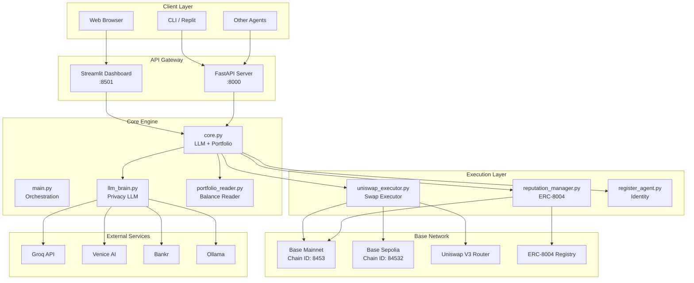
```mermaid
graph TB
    subgraph Client["Client Layer"]
        CLI[CLI / Replit]
        WEB[Web Browser]
        OTHER[Other Agents]
    end

    subgraph Gateway["API Gateway"]
        FASTAPI[FastAPI Server<br/>:8000]
        STREAMLIT[Streamlit Dashboard<br/>:8501]
    end

    subgraph Core["Core Engine"]
        MAIN[main.py<br/>Orchestration]
        CORE[core.py<br/>LLM + Portfolio]
        LLM[llm_brain.py<br/>Privacy LLM]
        PORTFOLIO[portfolio_reader.py<br/>Balance Reader]
    end

    subgraph Execution["Execution Layer"]
        UNISWAP[uniswap_executor.py<br/>Swap Executor]
        REPUTATION[reputation_manager.py<br/>ERC-8004]
        REGISTER[register_agent.py<br/>Identity]
    end

    subgraph Blockchain["Base Network"]
        MAINNET[Base Mainnet<br/>Chain ID: 8453]
        SEPOLIA[Base Sepolia<br/>Chain ID: 84532]
        UNISWAP_V3[Uniswap V3 Router]
        ERC8004[ERC-8004 Registry]
    end

    subgraph External["External Services"]
        GROQ[Groq API]
        VENICE[Venice AI]
        BANKR[Bankr]
        OLLAMA[Ollama]
    end

    CLI --> FASTAPI
    WEB --> STREAMLIT
    STREAMLIT --> CORE
    FASTAPI --> CORE
    CORE --> LLM
    CORE --> PORTFOLIO
    LLM --> GROQ
    LLM --> VENICE
    LLM --> BANKR
    LLM --> OLLAMA
    CORE --> UNISWAP
    CORE --> REPUTATION
    CORE --> REGISTER
    UNISWAP --> UNISWAP_V3
    UNISWAP --> MAINNET
    UNISWAP --> SEPOLIA
    REPUTATION --> ERC8004
    REPUTATION --> MAINNET
    OTHER --> FASTAPI
```

---

## Component Architecture

### 1. Main Entry Point (`main.py`)

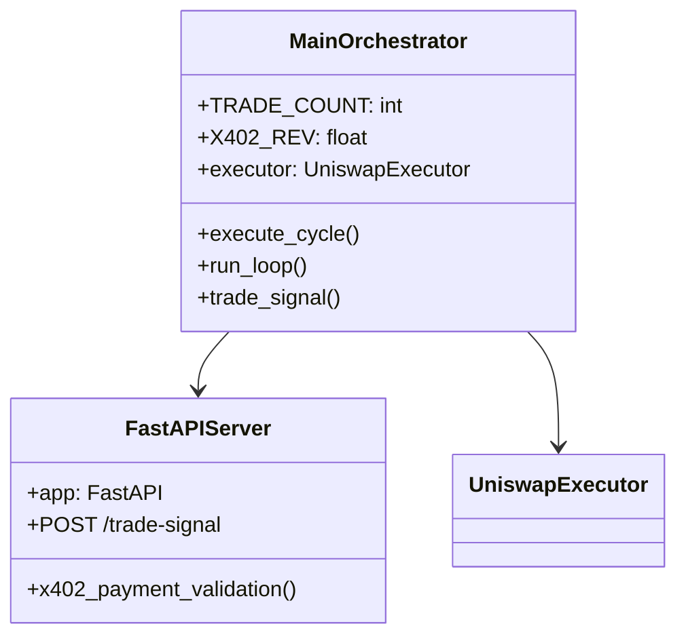
```mermaid
classDiagram
    class MainOrchestrator {
        +TRADE_COUNT: int
        +X402_REV: float
        +executor: UniswapExecutor
        +execute_cycle()
        +run_loop()
        +trade_signal()
    }
    
    class FastAPIServer {
        +app: FastAPI
        +POST /trade-signal
        +x402_payment_validation()
    }
    
    MainOrchestrator --> FastAPIServer
    MainOrchestrator --> UniswapExecutor
```

### 2. Core Engine (`core.py`)

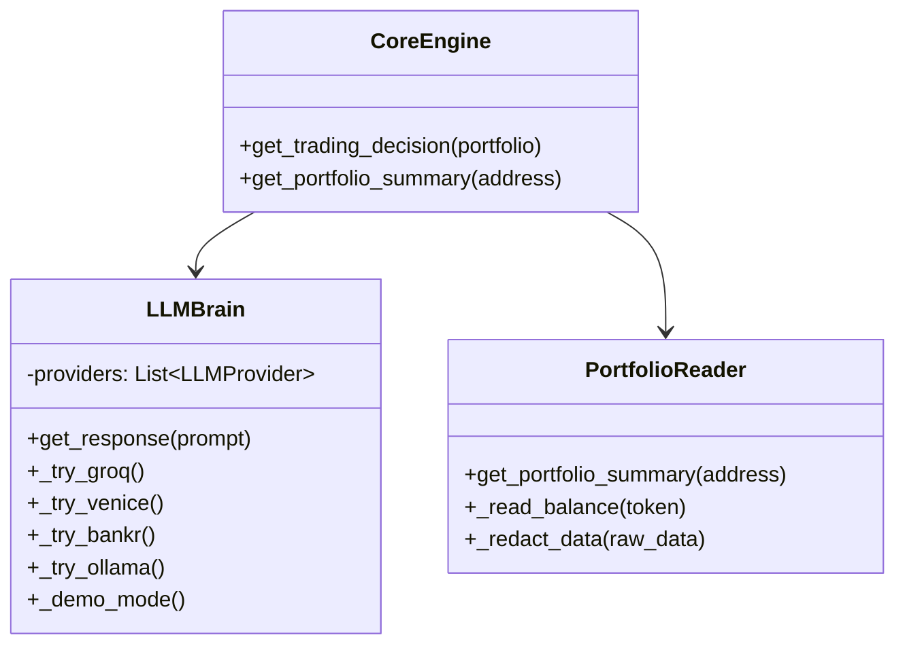
```mermaid
classDiagram
    class CoreEngine {
        +get_trading_decision(portfolio)
        +get_portfolio_summary(address)
    }
    
    class LLMBrain {
        -providers: List~LLMProvider~
        +get_response(prompt)
        +_try_groq()
        +_try_venice()
        +_try_bankr()
        +_try_ollama()
        +_demo_mode()
    }
    
    class PortfolioReader {
        +get_portfolio_summary(address)
        +_read_balance(token)
        +_redact_data(raw_data)
    }
    
    CoreEngine --> LLMBrain
    CoreEngine --> PortfolioReader
```

### 3. Uniswap Executor (`uniswap_executor.py`)

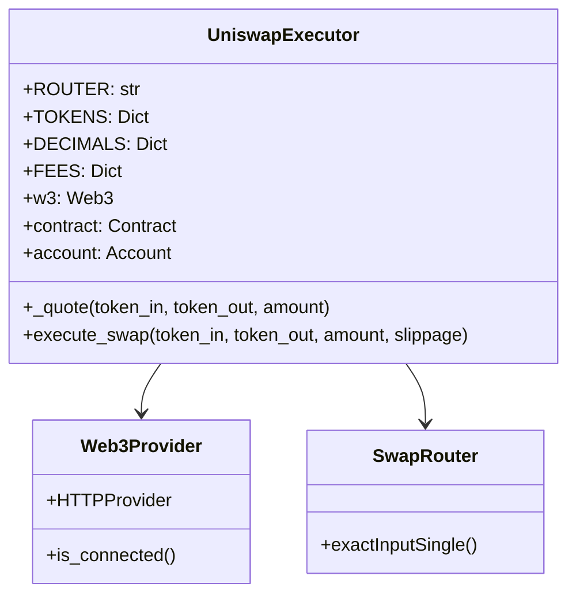
```mermaid
classDiagram
    class UniswapExecutor {
        +ROUTER: str
        +TOKENS: Dict
        +DECIMALS: Dict
        +FEES: Dict
        +w3: Web3
        +contract: Contract
        +account: Account
        +_quote(token_in, token_out, amount)
        +execute_swap(token_in, token_out, amount, slippage)
    }
    
    class Web3Provider {
        +HTTPProvider
        +is_connected()
    }
    
    class SwapRouter {
        +exactInputSingle()
    }
    
    UniswapExecutor --> Web3Provider
    UniswapExecutor --> SwapRouter
```

---

## Data Flow Diagrams

### Trading Cycle Data Flow

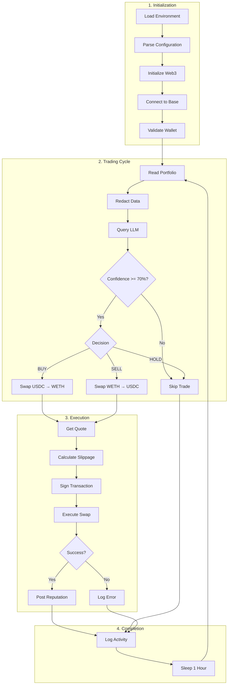
```mermaid
flowchart TD
    subgraph Init["1. Initialization"]
        A[Load Environment] --> B[Parse Configuration]
        B --> C[Initialize Web3]
        C --> D[Connect to Base]
        D --> E[Validate Wallet]
    end

    subgraph Cycle["2. Trading Cycle"]
        E --> F[Read Portfolio]
        F --> G[Redact Data]
        G --> H[Query LLM]
        H --> I{Confidence >= 70%?}
        I -->|No| J[Skip Trade]
        I -->|Yes| K{Decision}
        K -->|BUY| L[Swap USDC → WETH]
        K -->|SELL| M[Swap WETH → USDC]
        K -->|HOLD| J
    end

    subgraph Execution["3. Execution"]
        L --> N[Get Quote]
        M --> N
        N --> O[Calculate Slippage]
        O --> P[Sign Transaction]
        P --> Q[Execute Swap]
        Q --> R{Success?}
        R -->|Yes| S[Post Reputation]
        R -->|No| T[Log Error]
    end

    subgraph Complete["4. Completion"]
        S --> U[Log Activity]
        J --> U
        T --> U
        U --> V[Sleep 1 Hour]
        V --> F
    end
```

### LLM Fallback Chain

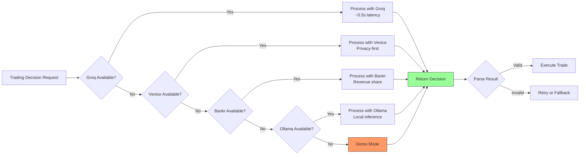
```mermaid
flowchart LR
    A[Trading Decision Request] --> B{Groq Available?}
    
    B -->|Yes| C[Process with Groq<br/>~0.5s latency]
    B -->|No| D{Venice Available?}
    
    D -->|Yes| E[Process with Venice<br/>Privacy-first]
    D -->|No| F{Bankr Available?}
    
    F -->|Yes| G[Process with Bankr<br/>Revenue share]
    F -->|No| H{Ollama Available?}
    
    H -->|Yes| I[Process with Ollama<br/>Local inference]
    H -->|No| J[Demo Mode]
    
    C --> K[Return Decision]
    E --> K
    G --> K
    I --> K
    J --> K
    
    K --> L{Parse Result}
    L -->|Valid| M[Execute Trade]
    L -->|Invalid| N[Retry or Fallback]
    
    style J fill:#f96,stroke:#333
    style K fill:#9f9,stroke:#333
```

---

## Network Architecture

### Multi-Network Support

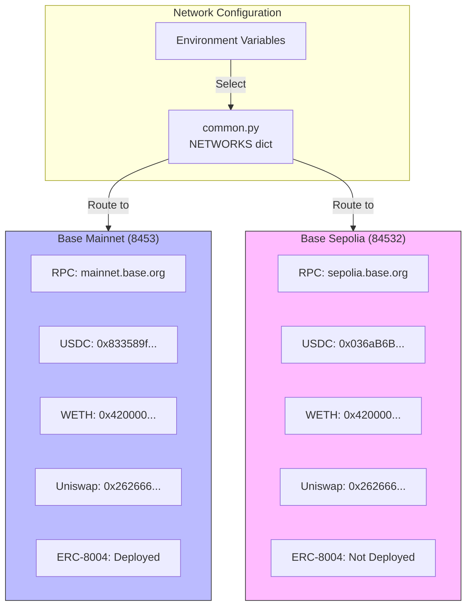
```mermaid
flowchart TB
    subgraph Configuration["Network Configuration"]
        ENV[Environment Variables]
        CONFIG[common.py<br/>NETWORKS dict]
    end

    subgraph Mainnet["Base Mainnet (8453)"]
        M_RPC[RPC: mainnet.base.org]
        M_USDC[USDC: 0x833589f...]
        M_WETH[WETH: 0x420000...]
        M_UNISWAP[Uniswap: 0x262666...]
        M_ERC8004[ERC-8004: Deployed]
    end

    subgraph Sepolia["Base Sepolia (84532)"]
        S_RPC[RPC: sepolia.base.org]
        S_USDC[USDC: 0x036aB6B...]
        S_WETH[WETH: 0x420000...]
        S_UNISWAP[Uniswap: 0x262666...]
        S_ERC8004[ERC-8004: Not Deployed]
    end

    ENV --> |Select| CONFIG
    CONFIG --> |Route to| Mainnet
    CONFIG --> |Route to| Sepolia
    
    style Mainnet fill:#bbf,stroke:#333
    style Sepolia fill:#fbf,stroke:#333
```

### RPC Connection Flow

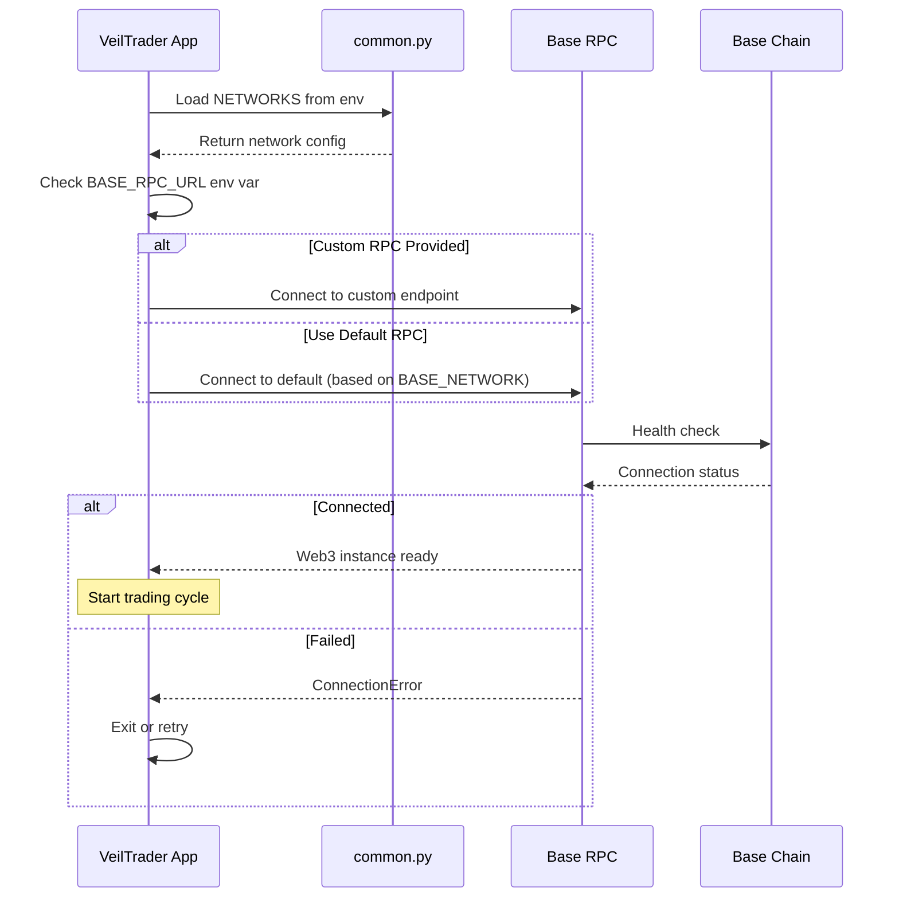
```mermaid
sequenceDiagram
    participant App as VeilTrader App
    participant Config as common.py
    participant RPC as Base RPC
    participant Chain as Base Chain

    App->>Config: Load NETWORKS from env
    Config-->>App: Return network config
    
    App->>App: Check BASE_RPC_URL env var
    
    alt Custom RPC Provided
        App->>RPC: Connect to custom endpoint
    else Use Default RPC
        App->>RPC: Connect to default (based on BASE_NETWORK)
    end
    
    RPC->>Chain: Health check
    Chain-->>RPC: Connection status
    
    alt Connected
        RPC-->>App: Web3 instance ready
        Note over App: Start trading cycle
    else Failed
        RPC-->>App: ConnectionError
        App->>App: Exit or retry
    end
```

---

## Security Architecture

### Privacy Model

```mermaid
flowchart TD
    subgraph Data["Data Flow"]
        RAW[Raw Wallet Data]
        PORTFOLIO[Portfolio Data]
        REDACTED[Redacted Data]
        LLM[LLM Request]
    end

    subgraph Privacy["Privacy Layers"]
        L1[Layer 1: No Logging]
        L2[Layer 2: Redaction]
        L3[Layer 3: Session Only]
        L4[Layer 4: Minimal Disclosure]
    end

    RAW --> |Read| PORTFOLIO
    PORTFOLIO --> |Process| REDACTED
    REDACTED --> |Send| LLM
    
    REDACTED:::highlight
    
    L1 --> L2
    L2 --> L3
    L3 --> L4
    
    classDef highlight fill:#9f9,stroke:#333,stroke-width:3px

    note right of REDACTED
        Example: "~$500 USDC, ~0.1 ETH"
        Not: "0x1234... USDC: 500000000"
    end
```

### Risk Control Layers

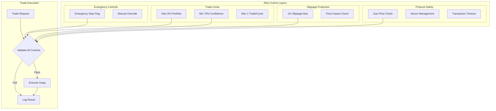
```mermaid
flowchart TB
    subgraph Controls["Risk Control Layers"]
        subgraph Emergency["Emergency Controls"]
            E1[Emergency Stop Flag]
            E2[Manual Override]
        end
        
        subgraph TradeLimits["Trade Limits"]
            T1[Max 5% Portfolio]
            T2[Min 70% Confidence]
            T3[Max 1 Trade/Cycle]
        end
        
        subgraph Slippage["Slippage Protection"]
            S1[1% Slippage Max]
            S2[Price Impact Check]
        end
        
        subgraph Protocol["Protocol Safety"]
            P1[Gas Price Check]
            P2[Nonce Management]
            P3[Transaction Timeout]
        end
    end

    subgraph Execution["Trade Execution"]
        REQUEST[Trade Request]
        VALIDATE{Validate All Controls}
        EXECUTE[Execute Swap]
        LOG[Log Result]
    end

    REQUEST --> VALIDATE
    VALIDATE -->|Pass| EXECUTE
    VALIDATE -->|Fail| LOG
    EXECUTE --> LOG
    
    E1 --> VALIDATE
    T1 --> VALIDATE
    T2 --> VALIDATE
    S1 --> VALIDATE
    P1 --> VALIDATE
```

---

## Deployment Architecture

### Replit Deployment

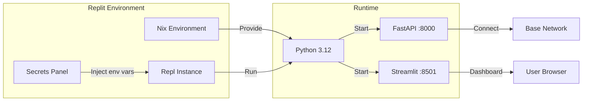
```mermaid
flowchart LR
    subgraph Replit["Replit Environment"]
        SECRETS[Secrets Panel]
        REPL[Repl Instance]
        NIX[Nix Environment]
    end

    subgraph Runtime["Runtime"]
        PYTHON[Python 3.12]
        FASTAPI[FastAPI :8000]
        STREAMLIT[Streamlit :8501]
    end

    SECRETS --> |Inject env vars| REPL
    NIX --> |Provide| PYTHON
    REPL --> |Run| PYTHON
    PYTHON --> |Start| FASTAPI
    PYTHON --> |Start| STREAMLIT
    
    FASTAPI --> |Connect| BASE[Base Network]
    STREAMLIT --> |Dashboard| USER[User Browser]
```

### Docker Deployment

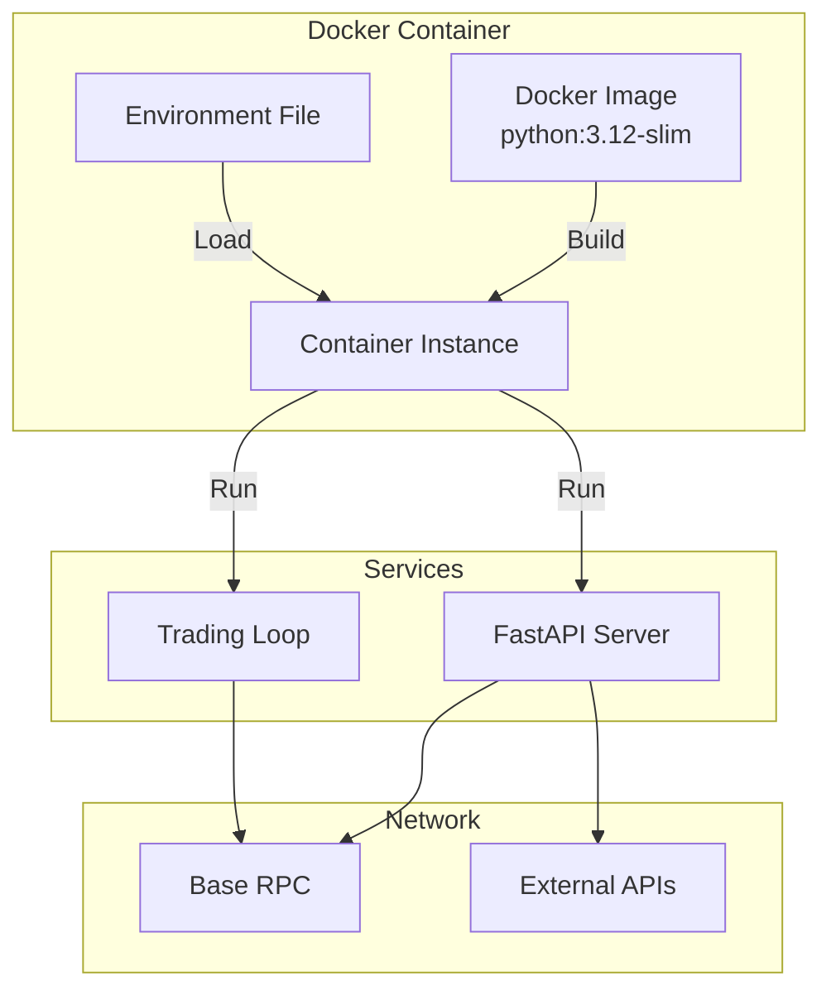
```mermaid
flowchart TB
    subgraph Docker["Docker Container"]
        IMAGE[Docker Image<br/>python:3.12-slim]
        CONTAINER[Container Instance]
        ENV[Environment File]
    end

    subgraph Services["Services"]
        FASTAPI_D[FastAPI Server]
        LOOP_D[Trading Loop]
    end

    subgraph Network["Network"]
        BASE_D[Base RPC]
        EXTERNAL[External APIs]
    end

    IMAGE --> |Build| CONTAINER
    ENV --> |Load| CONTAINER
    CONTAINER --> |Run| FASTAPI_D
    CONTAINER --> |Run| LOOP_D
    FASTAPI_D --> BASE_D
    LOOP_D --> BASE_D
    FASTAPI_D --> EXTERNAL
```

### Production VPS Deployment

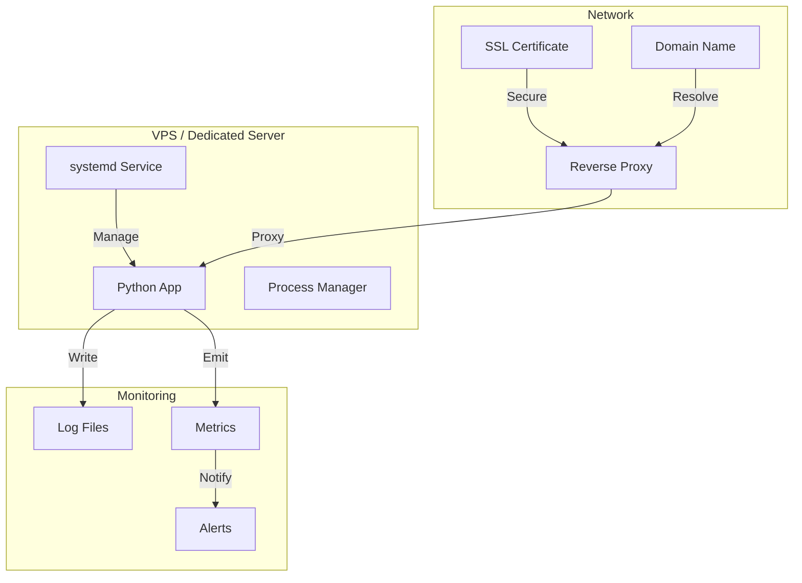
```mermaid
flowchart TB
    subgraph Server["VPS / Dedicated Server"]
        SYSTEMD[systemd Service]
        PYTHON[Python App]
        PM2[Process Manager]
    end

    subgraph Network["Network"]
        NGINX[Reverse Proxy]
        SSL[SSL Certificate]
        DOMAIN[Domain Name]
    end

    subgraph Monitoring["Monitoring"]
        LOGS[Log Files]
        METRICS[Metrics]
        ALERTS[Alerts]
    end

    SYSTEMD --> |Manage| PYTHON
    NGINX --> |Proxy| PYTHON
    SSL --> |Secure| NGINX
    DOMAIN --> |Resolve| NGINX
    
    PYTHON --> |Write| LOGS
    PYTHON --> |Emit| METRICS
    METRICS --> |Notify| ALERTS
```

---

## Sequence Diagrams

### Hourly Trading Cycle

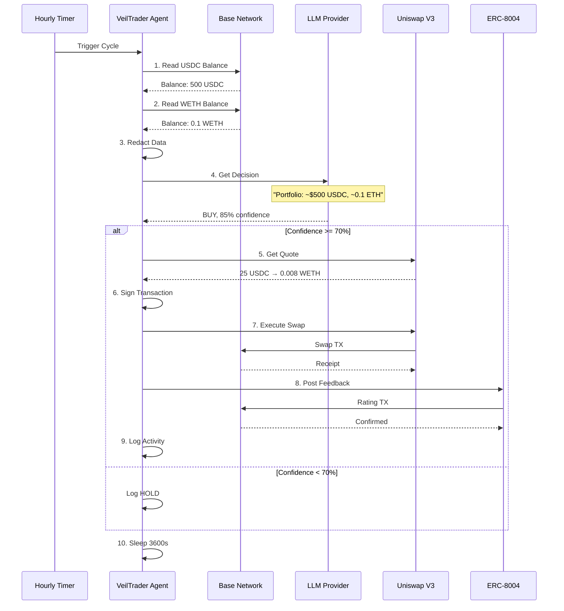
```mermaid
sequenceDiagram
    participant Timer as Hourly Timer
    participant Agent as VeilTrader Agent
    participant Chain as Base Network
    participant LLM as LLM Provider
    participant Uniswap as Uniswap V3
    participant Registry as ERC-8004

    Timer->>Agent: Trigger Cycle
    
    Agent->>Chain: 1. Read USDC Balance
    Chain-->>Agent: Balance: 500 USDC
    
    Agent->>Chain: 2. Read WETH Balance
    Chain-->>Agent: Balance: 0.1 WETH
    
    Agent->>Agent: 3. Redact Data
    
    Agent->>LLM: 4. Get Decision
    Note over LLM: "Portfolio: ~$500 USDC, ~0.1 ETH"
    LLM-->>Agent: BUY, 85% confidence
    
    alt Confidence >= 70%
        Agent->>Uniswap: 5. Get Quote
        Uniswap-->>Agent: 25 USDC → 0.008 WETH
        
        Agent->>Agent: 6. Sign Transaction
        Agent->>Uniswap: 7. Execute Swap
        Uniswap->>Chain: Swap TX
        Chain-->>Uniswap: Receipt
        
        Agent->>Registry: 8. Post Feedback
        Registry->>Chain: Rating TX
        Chain-->>Registry: Confirmed
        
        Agent->>Agent: 9. Log Activity
    else Confidence < 70%
        Agent->>Agent: Log HOLD
    end
    
    Agent->>Agent: 10. Sleep 3600s
```

### x402 Payment Flow

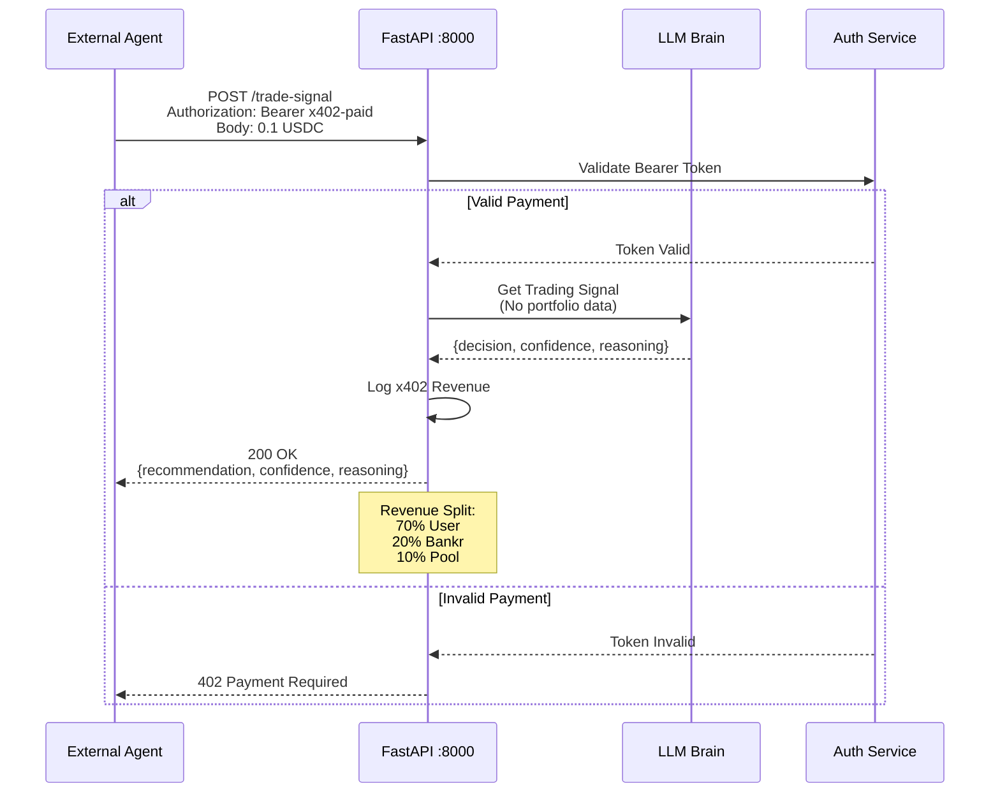
```mermaid
sequenceDiagram
    participant Client as External Agent
    participant Server as FastAPI :8000
    participant LLM as LLM Brain
    participant Auth as Auth Service

    Client->>Server: POST /trade-signal<br/>Authorization: Bearer x402-paid<br/>Body: 0.1 USDC
    
    Server->>Auth: Validate Bearer Token
    
    alt Valid Payment
        Auth-->>Server: Token Valid
        
        Server->>LLM: Get Trading Signal<br/>(No portfolio data)
        LLM-->>Server: {decision, confidence, reasoning}
        
        Server->>Server: Log x402 Revenue
        
        Server-->>Client: 200 OK<br/>{recommendation, confidence, reasoning}
        
        Note over Server: Revenue Split:<br/>70% User<br/>20% Bankr<br/>10% Pool
    else Invalid Payment
        Auth-->>Server: Token Invalid
        Server-->>Client: 402 Payment Required
    end
```

### Agent Registration Flow

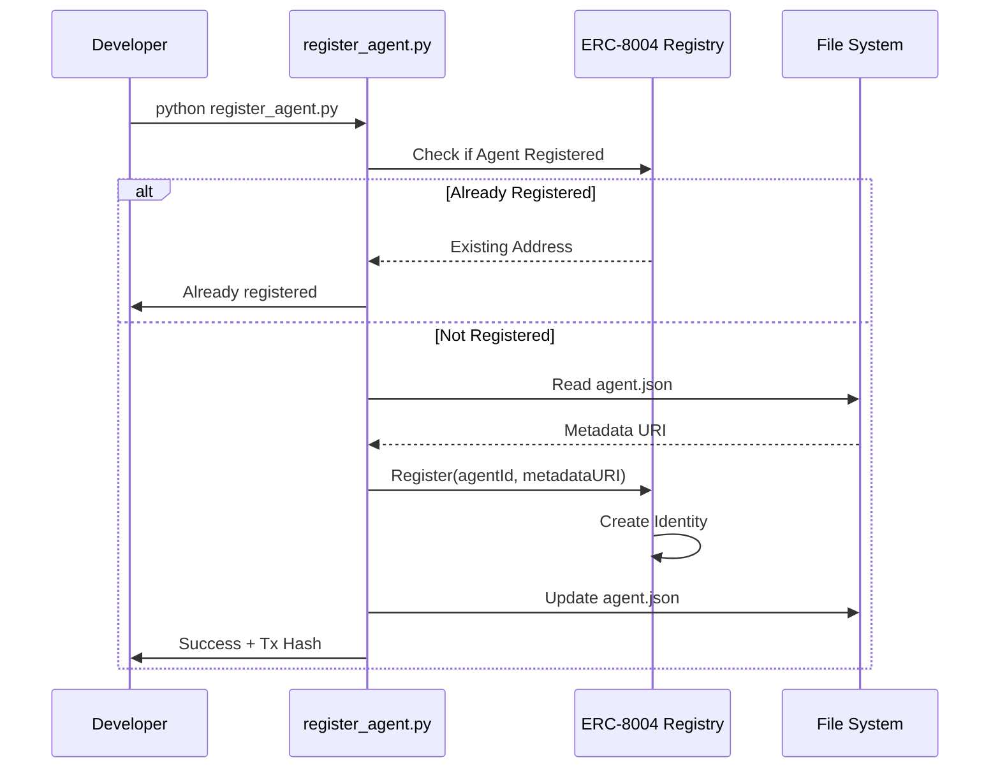
```mermaid
sequenceDiagram
    participant Dev as Developer
    participant Script as register_agent.py
    participant Chain as ERC-8004 Registry
    participant FS as File System

    Dev->>Script: python register_agent.py
    
    Script->>Chain: Check if Agent Registered
    
    alt Already Registered
        Chain-->>Script: Existing Address
        Script->>Dev: Already registered
    else Not Registered
        Script->>FS: Read agent.json
        FS-->>Script: Metadata URI
        
        Script->>Chain: Register(agentId, metadataURI)
        Chain->>Chain: Create Identity
        
        Script->>FS: Update agent.json
        Script->>Dev: Success + Tx Hash
    end
```

---

## State Diagrams

### Agent Lifecycle

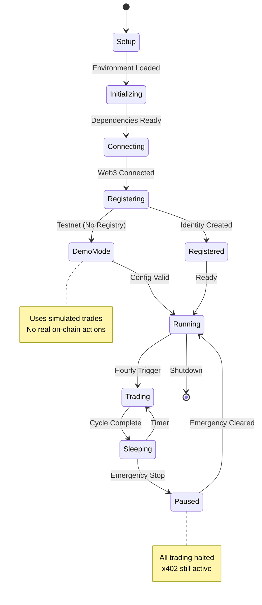
```mermaid
stateDiagram-v2
    [*] --> Setup
    Setup --> Initializing: Environment Loaded
    
    Initializing --> Connecting: Dependencies Ready
    Connecting --> Registering: Web3 Connected
    
    Registering --> Registered: Identity Created
    Registering --> DemoMode: Testnet (No Registry)
    
    DemoMode --> Running: Config Valid
    Registered --> Running: Ready
    
    Running --> Trading: Hourly Trigger
    Trading --> Sleeping: Cycle Complete
    
    Sleeping --> Trading: Timer
    Sleeping --> Paused: Emergency Stop
    
    Paused --> Running: Emergency Cleared
    Running --> [*]: Shutdown
    
    note right of DemoMode: Uses simulated trades<br/>No real on-chain actions
    note right of Paused: All trading halted<br/>x402 still active
```

### Trade State Machine

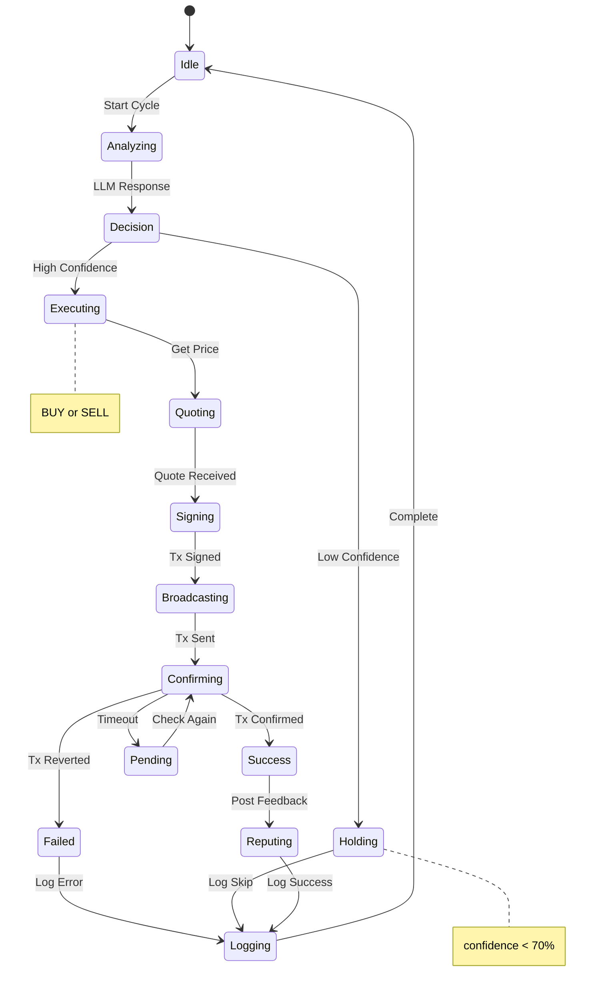
```mermaid
stateDiagram-v2
    [*] --> Idle
    Idle --> Analyzing: Start Cycle
    
    Analyzing --> Decision: LLM Response
    Decision --> Holding: Low Confidence
    Decision --> Executing: High Confidence
    
    Executing --> Quoting: Get Price
    Quoting --> Signing: Quote Received
    
    Signing --> Broadcasting: Tx Signed
    Broadcasting --> Confirming: Tx Sent
    
    Confirming --> Success: Tx Confirmed
    Confirming --> Failed: Tx Reverted
    Confirming --> Pending: Timeout
    
    Success --> Reputing: Post Feedback
    Pending --> Confirming: Check Again
    Failed --> Logging: Log Error
    Holding --> Logging: Log Skip
    Reputing --> Logging: Log Success
    
    Logging --> Idle: Complete
    
    note right of Executing: BUY or SELL
    note right of Holding: confidence < 70%
```

---

## Component Specifications

### Module Responsibilities

| Module | Responsibility | Dependencies |
|--------|---------------|--------------|
| `main.py` | Orchestration, FastAPI server, loop | core, uniswap, reputation |
| `core.py` | Business logic, LLM + portfolio coordination | llm_brain, portfolio_reader |
| `llm_brain.py` | LLM routing, fallback chain, response parsing | groq, requests |
| `portfolio_reader.py` | Balance reading, data redaction | web3, common |
| `uniswap_executor.py` | Swap execution, quote fetching | web3, requests |
| `reputation_manager.py` | ERC-8004 feedback posting | web3 |
| `register_agent.py` | Agent identity registration | web3 |
| `common.py` | Shared utilities, network config | web3, requests |

### API Contracts

#### `POST /trade-signal`

**Request:**
```json
{
  "headers": {
    "Authorization": "Bearer x402-paid"
  }
}
```

**Response (200):**
```json
{
  "recommendation": "BUY",
  "confidence": 85,
  "reasoning": "Based on portfolio analysis...",
  "timestamp": 1712000000,
  "service": "VeilTrader AI"
}
```

**Response (402):**
```json
{
  "detail": "Payment required: 0.1 USDC"
}
```

---

## Performance Considerations

### Latency Targets

| Operation | Target | Max |
|-----------|--------|-----|
| Portfolio Read | 100ms | 500ms |
| LLM Response | 500ms | 2000ms |
| Quote Fetch | 200ms | 1000ms |
| Tx Broadcast | 100ms | 500ms |
| Tx Confirmation | 2s | 30s |

### Resource Usage

```
┌─────────────────────────────────────────┐
│            Resource Allocation          │
├─────────────────────────────────────────┤
│                                          │
│  Memory: ~100-200 MB                     │
│  CPU: Minimal during sleep              │
│        Spike during trading cycle       │
│  Network: ~50 requests/hour              │
│  Storage: agent_log.json grows ~1MB/day │
│                                          │
└─────────────────────────────────────────┘
```

---

## Error Handling

### Error Categories

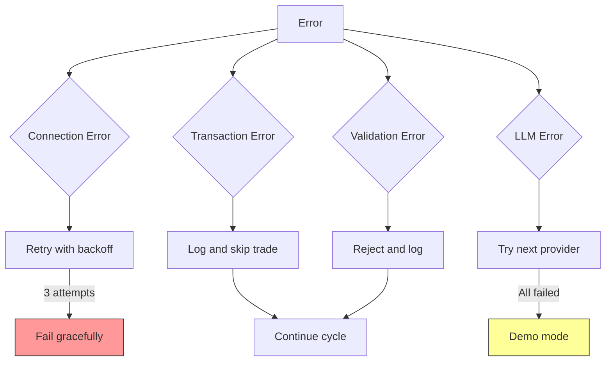
```mermaid
flowchart TD
    E[Error] --> C1{Connection Error}
    E --> C2{Transaction Error}
    E --> C3{LLM Error}
    E --> C4{Validation Error}
    
    C1 --> R1[Retry with backoff]
    C2 --> R2[Log and skip trade]
    C3 --> R3[Try next provider]
    C4 --> R4[Reject and log]
    
    R1 --> |3 attempts| F[Fail gracefully]
    R2 --> N[Continue cycle]
    R3 --> |All failed| D[Demo mode]
    R4 --> N
    
    style F fill:#f99,stroke:#333
    style D fill:#ff9,stroke:#333
```

---

## Future Architecture Considerations

### Planned Enhancements

1. **Multi-Chain Support** - Ethereum, Optimism, Arbitrum
2. **Advanced Order Types** - Limit orders, TWAP
3. **Portfolio Rebalancing** - Automatic diversification
4. **MEV Protection** - Flashbots integration
5. **Machine Learning** - Price prediction models

---

<p align="center">
  <sub>
    Last updated: March 2026<br/>
    Version: 1.0.0
  </sub>
</p>
